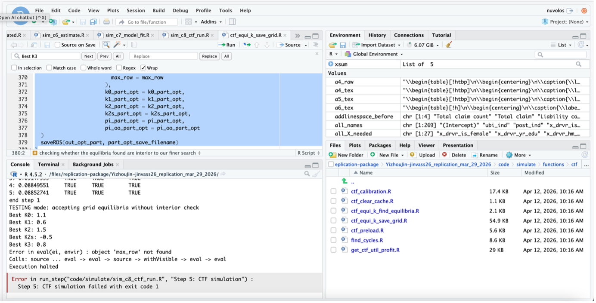
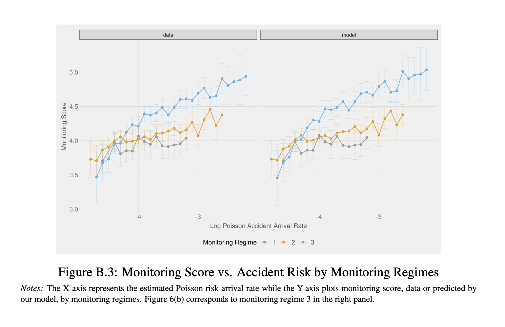
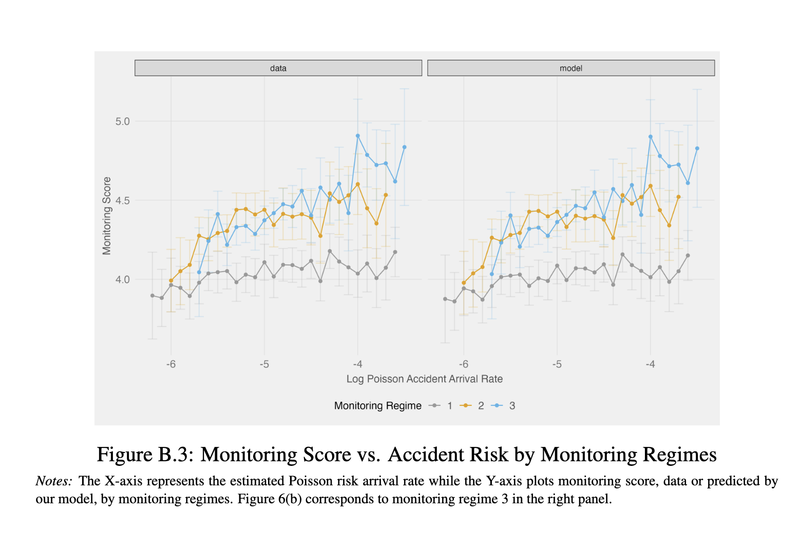
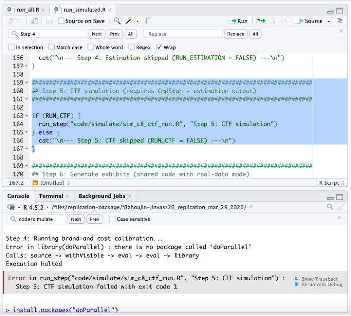

# Paper Identification

|  |   |
| ---  |  -------|
| ID  |   |
| Author  |   |
| Title  |   |
| Iteration |   |


Some useful information up front:

- [JPE Data and Code Availability Policy](https://www.journals.uchicago.edu/journals/jpe/datapolicy)
- [Step by step guidance from Data Editor for Authors](https://jpedataeditor.github.io/) 
- [Template README](https://social-science-data-editors.github.io/template_README/)


# Summary

> {REPLICATOR} The Data Editor will fill this part out. It will be based on any {REQUIRED} and {SUGGESTED} action items that the report makes a note of.


In assessing compliance with our [Data and Code Availability Policy](https://www.journals.uchicago.edu/journals/jpe/datapolicy), our reproducibility team has identified the following issues, which we ask you to address:

# General

- [x] Data Availability and Provenance Statements
  - [x] Statement about Rights - Part 1: Right to use the data (e.g. *did the authors lawfully obtain the data*)
  - [x] Statement about Rights - Part 2: Right to publish the data (e.g. *are human subjects involved and did permission been granted to publish their data?*)
  - [ ] License for Data (optional, but recommended)
  - [x] Details on each Data Source
- [x] Dataset list
- [x] Computational requirements
  - [x] Software Requirements
  - [x] Controlled Randomness (as necessary)
  - [x] Memory, Runtime, and Storage Requirements
- [x] Description of programs/code
  - [x] License for Code (Optional, but recommended) 
- [x] List of tables and programs
- [x] References (Optional, but recommended) 


# High-level Description of Research Project

*This research project...*

- [x] uses observational data.
- [x] uses *confidential* observational data.
- [ ] uses data generated via experiment or trial by the authors (in field or lab).
  - [ ] For lab experiments: The code to implement the experimental protocol (z-Tree, o-Tree etc) is included in the package.
  - [ ] A PDF copy of IRB approval is contained in the package.
  - [ ] A PDF document outlining the design of the experiment, including information on the selection and eligibility of participants is included.
  - [ ] A PDF copy of the instructions given to participants in both original language and an English translation is included.
- [ ] uses data generated via survey by the authors (in field or online)
  - [ ] The programs used to administer the survey (e.g. qualtrics survey file) are included.
  - [ ] A PDF copy of IRB approval is contained in the package.
  - [ ] A PDF of the original questionaire(s) and information on the selection and eligibility of participants is included.
- [ ] is a simulation study: the data are generated by an algorithm.
- [ ] is a numerical illustration: no data are used but code is used to produce illustrative output (tables, figures)


# Data description

For any data that cannot be provided as part of the replication package, please provide the following information as part of the README.

> {REQUIRED}  Please specify how long the data will be preserved in the restricted-access location.

> {REQUIRED} Please provide affirmation of support for replication checks.
  - As per the [JPE policy](https://jpedataeditor.github.io/policy.html), "In cases where data cannot be published in an openly accessible trusted data repository like the JPE dataverse, authors who have requested an exemption to publish them at the time of first submission must commit to preserving the data and code for a period of no less than five years following the publication of the paper. They should also provide reasonable assistance to requests for clarification and replication."


> {REQUIRED} Please provide a codebook for the data.
  - The codebook should at a minimum describe the variables obtained from the data source, in a manner that will let others verify that they have obtained a substantially similar dataset if successfully obtaining access to the data.


## Data Sources

- [ ] Dataset is provided in public (dataverse) deposit
- [x] Dataset is PRIVATELY provided (not for publication)
- [ ] DOI or URL is provided, and works: (PROVIDE URL OR DOI HERE)
- [x] Access conditions are described:
  - The data is not publicly available and requires a data use agreement to access.
- [ ] Data are not cited, but a working paper, article, or other document is cited > (not a data citation)
- [ ] Data are cited
  - [ ] in the manuscript
  - [ ] in the README

# Requirements 

- [x] README is in TXT, MD, or PDF format
- [x] README is accessible at the root of the package (not inside a folder)
- [x] Title conforms to guidance (starts with "Data and Code for: Title of Paper" or "Code for: Title of Paper", is properly capitalized)
- [ ] Authors (with affiliations) are listed in the same order as on the paper:

Note: Affiliations are missing from the README.


## Stated Requirements

- [ ] No requirements specified
- [x] Software Requirements specified as follows:
  - R (version 4.3.0 or above)
  - CmdStan (version 2.34 or above)
- [ ] Computational Requirements specified as follows:
  - Cluster size, etc.
- [x] Time Requirements specified as follows:
  - ~10–30 hrs

# Analyzing Data and Code Files











## Code description

There are three provided R run files, including a master "run all" file.




- [x] The replication package contains a "main" or "master" file(s) which calls all other auxiliary programs.


## Computing Environment of the Replicator

- RStudio 2026.01 + R 4.5.2 + Quarto + JDK 21  242.8 MB
- Mac Laptop M2 MacBook Pro, MacOS Monterey, 8 GB of memory, (M1 Processor)


# Replication

- Downloaded code and data from dropbox.
- Commited code to git repo.
- Ran code as per README, but Step 5 (CTF simulation) in `run_simulated.R` failed when executing `sim_c8_ctf_run.R`. The error message was:

```R
Error in eval(ei, envir): object ‘max_row’ not found
```

- The error originates from a call chain:
  - `run_simulated.R` calls `simulate/sim_c8_ctf_run.R` on line 164
  - then `simulate/sim_c8_ctf_run.R` calls to `simulate/functions/ctf/ctf_equi_k_save_grid.R` on line 295, where the variable max_row is used but not defined.

- This was resolved by adding `max_row <- max_row_coarse` to line 445 in `ctf_equi_k_save_grid.R`, after `max_row_fine = 2`
- The issue was not documented in the replication package, and no log files were generated for simulation steps, so the error only appeared in console output:

{width=80%}

- Ran again and code ran to completion. 


# Findings {#sec-findings}

The replication reproduced the overall structure of the paper and the qualitative results in the tables and figures, including consistency between data and model outputs across panels.

Differences in the levels of the plotted values in several of the figures presenting simulated data were observed (figures in the Appendices), but these were expected (simulated data is designed to generate qualitatively similar but numerically different results):

{width=80%}

{width=80%}

## Missing Requirements

- [ ] Software Requirements 
  - [ ] Stata
    - [ ] Version
    - Packages go here
  - [ ] Matlab
    - [ ] Version
  - [x] R
    - `doParallel`

Had to manually install 'doParallel' package during Step 5 (CTF simulation) in `run_simulated.R`:

```R
Error in library(doParallel): there is no package called ‘doParallel’
```

{width=80%}

## Data Preparation Code

- Program `run_all.R` ran without error, output expected data
- Program `run_simulated.R` ran with the errors documented above (package and code errors). Once fixed, output expected data

## Tables and Figures

All figures and tables in the main text of the paper were successfully generated.

The following exhibits were not generated in Section II, `run_simulated.R`:

- Tables A.9–A.15
- Tables C.2, C.4, C.5

The log printed in the RStudio console was as follows:

```R
> source("code/c3_get_fitctf_exhibits.R")

c3_get_fitctf_exhibits.R: Generating model fit + CTF exhibits...
  [GEN] tab_4.tex
  [GEN] tab_5.tex
  [SKIP] appendix/tab_c2.tex (no CSV)
  [GEN] fig_6a.png
  [GEN] fig_6b.png
  [GEN] appendix/fig_b3.png
  [GEN] appendix/fig_b4.png
  [GEN] tab_7.tex 
  [SKIP] appendix/tab_a9.tex (no CSV)
  [SKIP] appendix/tab_a10.tex (no CSV)
  [SKIP] appendix/tab_a11.tex (no CSV)
  [SKIP] appendix/tab_a12.tex (no CSV)
  [SKIP] appendix/tab_a13.tex (no CSV)
  [SKIP] appendix/tab_a14.tex (no CSV)
  [SKIP] appendix/tab_a15.tex (no CSV)
  [SKIP] appendix/tab_c4.tex (no CSV)
  [SKIP] appendix/tab_c5.tex (no CSV)

c3_get_fitctf_exhibits.R completed: 7 generated, 10 skipped
```

| Data Preparation Program       | Dataset created                                  | Reproduced?                       |  |
|--------------------------------|--------------------------------------------------|-----------------------------------|--|
| run_simulated.R                | Simulated datasets (JSON profiles, model inputs) | Yes                               |  |
| code/simulate/sim_c8_ctf_run.R | Counterfactual simulation outputs                | Yes (conditional on RUN_CTF)      |  |
| code/c1_get_rf_exhibits.R      | Reduced-form datasets for figures/tables         | Yes                               |  |
| code/c2_get_param_tables.R     | Model parameter tables (estimation outputs)      | Partial (some outputs missing)    |  |
| code/c3_get_fitctf_exhibits.R  | Model fit and counterfactual exhibit datasets    | Partial (some CSVs not generated) |  |

| Figure/Table   | Program                  | Line Number | Reproduced?                     |
|----------------|--------------------------|-------------|---------------------------------|
| Table 1        | c1_get_rf_exhibits.R     | —           | Yes                             |
| Table 2        | c1_get_rf_exhibits.R     | —           | Yes                             |
| Table 3        | c1_get_rf_exhibits.R     | —           | Yes                             |
| Table 4        | c3_get_fitctf_exhibits.R | —           | Yes                             |
| Table 5        | c3_get_fitctf_exhibits.R | —           | Yes                             |
| Table 6        | c2_get_param_tables.R    | —           | Partial (simulated differences) |
| Table 7        | c3_get_fitctf_exhibits.R | —           | Partial (simulated differences) |
| Figure 2a      | c1_get_rf_exhibits.R     | —           | Yes                             |
| Figure 2b      | c1_get_rf_exhibits.R     | —           | Yes                             |
| Figure 3       | c1_get_rf_exhibits.R     | —           | Yes                             |
| Figure 4       | c1_get_rf_exhibits.R     | —           | Yes                             |
| Figure 5       | c1_get_rf_exhibits.R     | —           | Yes                             |
| Figure 6a      | c3_get_fitctf_exhibits.R | —           | Partial (simulated differences) |
| Figure 6b      | c3_get_fitctf_exhibits.R | —           | Partial (simulated differences) |
| Fig 1a–d       | static                   | —           | No                              |
| Table A.1      | c1_get_rf_exhibits.R     | —           | Yes                             |
| Table A.3–A.6  | c2_get_param_tables.R    | —           | Partial (simulated differences) |
| Table A.7–A.8  | c2_get_param_tables.R    | —           | No                              |
| Table A.9–A.15 | c3_get_fitctf_exhibits.R | —           | No (CSV missing)                |
| Fig A.1–A.2    | static                   | —           | No                              |
| Fig A.3–A.6    | c1_get_rf_exhibits.R     | —           | Yes                             |
| Fig B.1–B.4    | mixed (c1/c3)            | —           | Partial (simulated differences) |
| Table C.1      | c1_get_rf_exhibits.R     | —           | Yes                             |
| Table C.2–C.3  | c3_get_fitctf_exhibits.R | —           | Partial (simulated differences) |
| Table C.4–C.5  | c3_get_fitctf_exhibits.R | —           | No (CSV missing)                |
| Fig C.1–C.4    | c1_get_rf_exhibits.R     | —           | Yes                             |

| In-text numbers | Program | Line Number | Reproduced? |
|-----------------|---------|-------------|-------------|
| —               | —       | —           |             |

## In-Text Numbers

- [ ] In-text numbers not verified.

- [x] There are no in-text numbers, or all in-text numbers stem from tables and figures.

- [ ] There are in-text numbers, but they are not identified in the code


# Classification

- [ ] full reproduction
- [x] full reproduction with minor issues
- [ ] partial reproduction (see above)
- [ ] not able to reproduce most or all of the results (reasons see above)

## Reason for incomplete reproducibility

- [x] None.
- [ ] `Discrepancy in output` (either figures or numbers in tables or text differ)
- [ ] `Bugs in code` that were fixable by the replicator (but should be fixed in the final deposit)
- [ ] `Code missing`, in particular if it prevented the replicator from completing the reproducibility check
  - [ ] `Data preparation code missing` should be checked if the code missing seems to be data preparation code
- [ ] `Code not functional` is more severe than a simple bug: it prevented the replicator from completing the reproducibility check
- [ ] `Software not available to replicator` may happen for a variety of reasons, but in particular (a) when the software is commercial, and the replicator does not have access to a licensed copy, or (b) the software is open-source, but a specific version required to conduct the reproducibility check is not available.
- [ ] `Insufficient time available to replicator` is applicable when (a) running the code would take weeks or more (b) running the code might take less time if sufficient compute resources were to be brought to bear, but no such resources can be accessed in a timely fashion (c) the replication package is very complex, and following all (manual and scripted) steps would take too long.
- [ ] `Data missing` is marked when data *should* be available, but was erroneously not provided, or is not accessible via the procedures described in the replication package
- [ ] `Data not available` is marked when data requires additional access steps, for instance purchase or application procedure. 
- [ ] `Missing README` is marked if there is no README to guide the replicator, or the README is not in compliance with JPE requirements